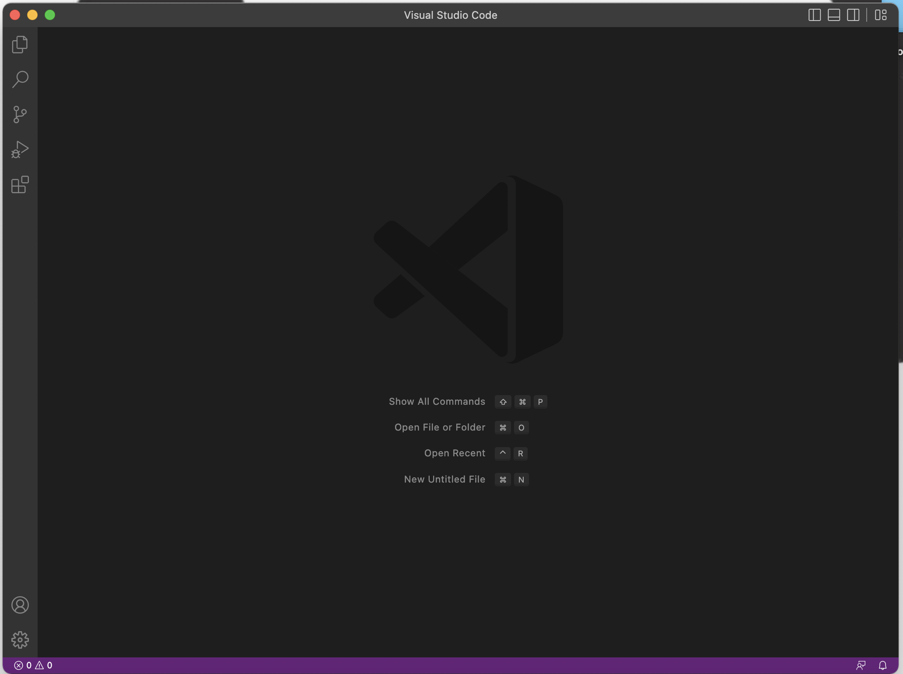

Step 1: Installing VSCode\
To install VSCode on your own computer, go to the following link: https://code.visualstudio.com/. \
Following instructions, you get VSCode downloaded. \
When you open it, if you see the following page, it means that your have successfully installed it.

Step 2: Remotely Connecting\
Firstly, open VSCode, and then create a terminal. \
Secondly, type the following command: ssh <your account name>@ieng6.ucsd.edu. \
You should replace <your account name> with your own UCSD account name.\
Then, the system will ask you to enter your password.\
When you're entering the password, nothing will appear on the screen due to safety concern.\
Just type it completely, and you will be logged in.\
When everything is done, you should see the following.

Step 3: Trying Some Commands\
Now that you have remotely connected to another computer, you can control your current directory by commands.\
Type cd ~ to change directory upwards.\
Type ls to see the files in current directory.
